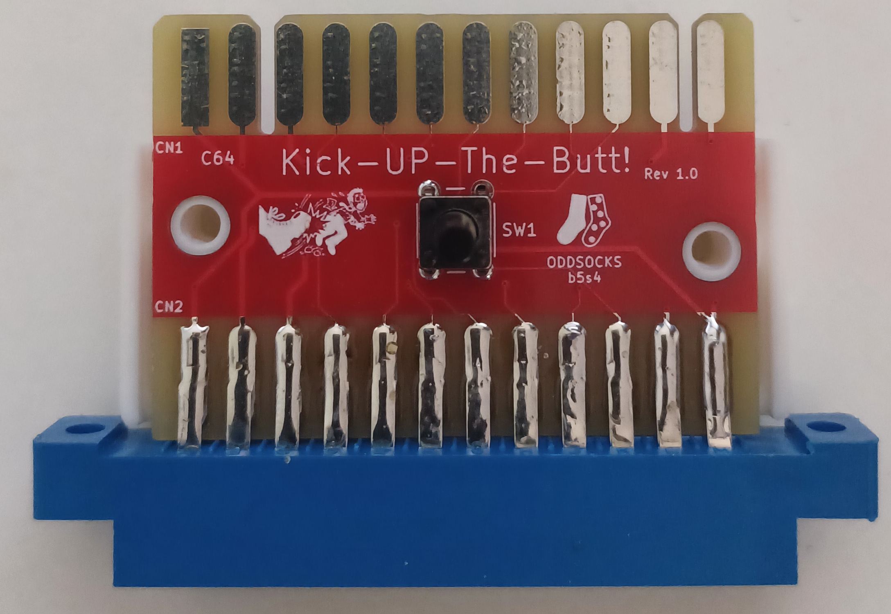
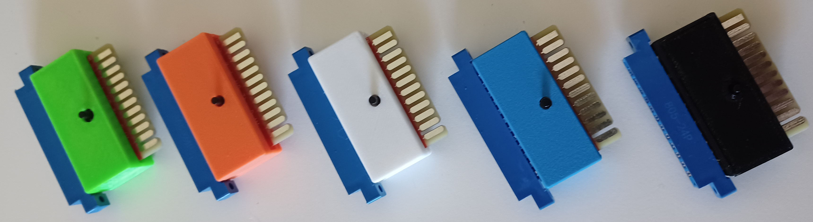
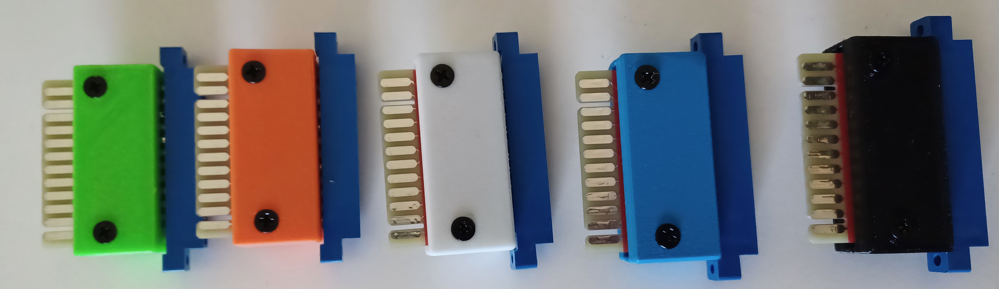

# Kick-Up-The-Butt - C64 / VIC20 Reset Cartridge

## Description
A reset cartridge with pass-through, for the C64 and VIC20, with a 3D printable case. It plugs into the user port and provides a simple reset button

## Bill of Materials

| Qty | Component                                                         |
|:---:|-------------------------------------------------------------------|
| 1   | 6x6mm Tactile Button - ideally tall (or use optional reset pin)   |
| 1   | 805-24P Connector - 24pin C64 / VIC20 User Port Connector         |

Ideally a tall tactile button should be used, but if you only have short ones you can 3D print the STL reset pin and use that to extend it.

## Case Assembly

* Insert the PCB into the bottom case part, aligning the holes in the PCB with screw posts
* Align the top part of the case with the bottom. (If using a reset pin, insert it begfore aligning)
* Screw together using 2 x 3.5mm self-tapping screws. Maximum length about 15mm.

---

## Support Me
* [My Projects](https://projects.amiga-hardware.com) - Donate on this page
* [Order the Kick-Up-The-Butt PCB](https://www.pcbway.com/project/shareproject/Kick_Up_The_Butt_User_Port_Reset_Cart_for_C64_VIC_20_fc886e20.html)
